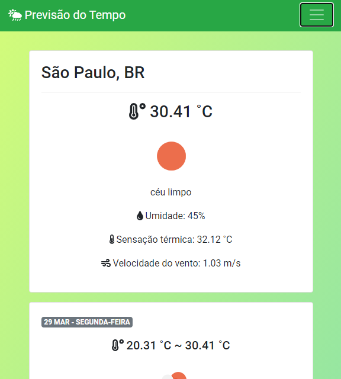
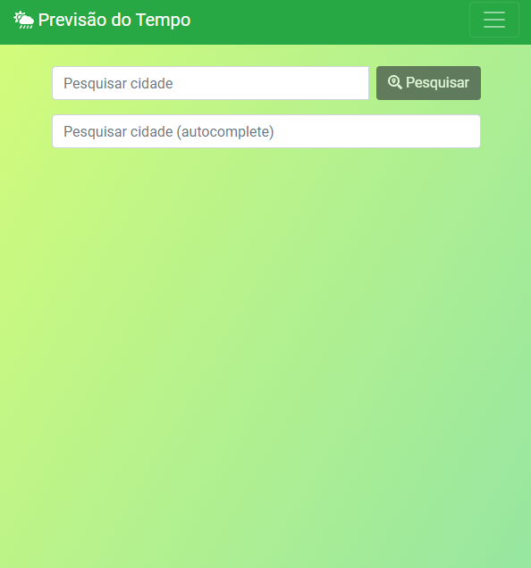
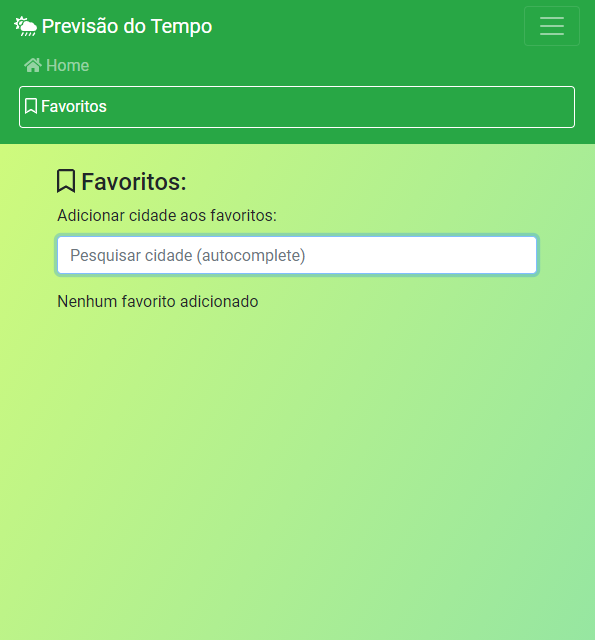

<h1 align="center">
:computer: Criando projeto para consultar a previsão do tempo via API
</h1>

<h1 align="center">

</h1>

<p align="center">
    <a href="https://www.linkedin.com/in/dev-full-stack/">
        
    </a>
</p>

---

### ⚔ Desafio

Desafio feito no Bootcamp da Digital Innovation One.

Consumir os recursos da **Open Weather Map API** em um *frontend* Angular.

O objetivo desse desavio foi realizar a integração de uma *Single Page Application* (SPA) em Angular com a Open Weather Map API. Esse exercício também abordou uma forma mais avançada de gerenciamento de estado com o NgRx, além de práticas e padrões de desenvolvimento, acompanhados de algumas APIs úteis do Angular.

---

### 📷 Screenshots






---

## 🛠️ Tecnologias Utilizadas

- HTML5;
- CSS3;
- JavaScript;
- Angular;

## ⏬ Como baixar o projeto
- <b style="color:red"> OBS: </b> É necessário ter o git instalado em sua máquina
- Executar o Seguinte comando no seu **Terminal** ou no **CMD**:

```bash
        git clone https://github.com/armandofc1/dioPrevisaoDoTempo.git
```
### 📚 Referências

-[openweather-api]:https://openweathermap.org/

-[ngrx-ref]:https://ngrx.io/

-[angular-ref]:https://angular.io/docs

## ⌨️ Autor

<br>
<sub><b>Armando Costa</b></sub>

##### Contatos
[](https://www.linkedin.com/in/dev-full-stack/)

